# 个人期末实验报告

## 题目

基于淘宝用户消费行为的大数据分析与精准运营研究

## 个人负责部分

MySQL 实现与 Spark / KMeans 用户聚类分析

## 学生信息

- 姓名：`[请填写]`
- 学号：`[请填写]`
- 班级：`[请填写]`
- 课程名称：大数据技术课程设计 / 大数据综合实验
- 指导教师：`[请填写]`
- 完成时间：`[请填写]`

---

## 摘要

本次期末实验围绕“基于淘宝用户消费行为的大数据分析与精准运营研究”展开。小组整体任务是利用淘宝用户消费行为数据、订单交易数据、用户画像数据和商品数据，从用户行为分析、用户价值分层、商品表现评估等角度完成一次完整的大数据分析实践。在小组分工中，我主要负责 MySQL 实现与 Spark / KMeans 用户聚类分析两部分内容，目标是补齐项目在结构化存储、多表关联查询以及机器学习分群方面的技术实现短板。

在 MySQL 部分，我围绕用户表、商品表、订单表和行为表设计了结构化数据库表结构，完成了建库建表 SQL、CSV 数据导入脚本以及多表关联查询示例。通过关系型建模，我将原始数据从文件形式映射为可查询、可关联、可复用的数据资源，为后续分析提供了结构化支撑。

在 Spark / KMeans 部分，我以用户消费行为特征为基础，构建了包含最近消费时间、订单频次、消费金额、浏览行为、点击行为、收藏行为、加购行为、订单质量特征和行为比例特征等在内的用户特征向量，并采用 Spark MLlib 中的 KMeans 算法进行用户聚类。实验进一步进行了不同 `k` 值对比和特征消融分析，最终发现移除 `engagement_score` 与 `member_level_score` 两个冗余特征后，聚类效果得到明显提升，并最终选择 `k=3` 作为最优聚类数，对应轮廓系数达到 `0.3542`。结合 RFM 分层结果对照分析发现，KMeans 聚类在高价值用户与流失风险用户识别上与 RFM 结果具有较高一致性：其中 Cluster 0 明显表现出高消费、高频次、高客单价的高价值特征，而 Cluster 1 则表现出消费周期长、订单少、消费低的流失风险特征。

本实验表明，MySQL 能够有效承担结构化存储与多表分析的基础角色，而 Spark / KMeans 能够作为规则分层的补充验证工具，从数据分布角度进一步识别用户价值层次。虽然当前聚类效果仍有继续优化空间，但整个实验已经实现了从原始数据到数据库建模，再到机器学习分群的较完整技术流程，为小组整体课题的完善提供了关键支撑。

**关键词**：MySQL；Spark；KMeans；RFM；用户聚类；电商数据分析

---

## 目录

1. 绪论
2. 实验目标与个人任务
3. 数据来源与数据特征
4. 整体技术路线
5. MySQL 模块设计与实现
6. Spark / KMeans 模块设计与实现
7. 实验结果与分析
8. 存在问题与改进方向
9. 总结

---

## 一、绪论

### 1.1 研究背景

随着电子商务平台快速发展，用户在平台上的每一次浏览、点击、收藏、加购、下单和评价行为，都会沉淀为可分析的数据资产。对于平台来说，真正的问题并不是“有没有数据”，而是“能不能把数据转化为运营决策能力”。如果不能识别高价值用户，平台就无法合理分配营销资源；如果不能识别低活跃用户，平台就无法及时进行用户召回；如果不能判断商品是否具有高转化潜力，平台就无法优化选品和流量分配策略。

在传统分析方式中，很多企业仅依赖简单报表统计，如订单量、销售额和客单价等指标。这些指标虽然可以描述整体经营结果，却很难回答更深入的问题，例如：

- 哪类用户的长期价值最高？
- 哪些用户虽然现在消费不高，但具有上升潜力？
- 哪些用户已经表现出明显流失倾向？
- 用户行为与最终消费结果之间到底存在怎样的关联？

这些问题本质上要求我们从“结果统计”转向“行为理解”和“用户分群”。

在本课题中，小组整体以淘宝用户消费行为数据为基础，构建从数据存储、数据处理、离线分析到结果可视化的完整分析链路。而我负责的 MySQL 与 Spark / KMeans 两部分，分别对应项目中两个很重要的层次：

- MySQL 负责解决“数据如何结构化落地”的问题；
- Spark / KMeans 负责解决“如何从多维特征中自动发现用户群体”的问题。

因此，我负责的部分既是项目的数据基础设施补充，也是用户价值分析模型的重要技术支撑。

### 1.2 研究意义

从课程设计角度看，完成这一部分工作具有两方面意义。

第一，MySQL 实现补充了项目的结构化数据管理能力。仅依赖 CSV 文件虽然能够完成部分分析，但在多表关联、字段约束、查询复用和数据组织方面都存在明显局限。通过关系型数据库建模，可以更好地组织用户、商品、订单和行为数据之间的逻辑关系，也更符合企业实际应用场景。

第二，Spark / KMeans 聚类为用户价值分层提供了规则模型之外的补充验证。RFM 模型的优点在于可解释性强，但它本质上仍是规则分层。KMeans 则能够从多维特征中自动发现用户群体，从另一个角度验证用户价值结构是否真实存在于数据分布中。两者结合后，可以使用户分群结果更具说服力。

### 1.3 个人工作定位

在本项目分工中，我负责的是一条偏“技术实现”与“模型验证”的主线。

具体而言，我的任务不是单纯撰写结论，而是通过代码、脚本和模型真正把以下内容落地：

- 将原始 CSV 数据映射到 MySQL 数据库；
- 设计和实现多表结构与多表关联查询；
- 基于订单与行为数据构造用户特征；
- 使用 Spark 完成 KMeans 聚类与轮廓系数评估；
- 将 KMeans 聚类结果与 RFM 分层结果进行对照分析。

也就是说，我这一部分的工作目标可以概括为：

> 从数据工程和机器学习两个角度，增强整个课题在技术实现层面的完整性与可信度。

---

## 二、实验目标与个人任务

### 2.1 实验目标

结合本次课设的总体要求，我负责部分的实验目标主要包括以下四项：

1. 建立用户、商品、订单、行为四类核心数据在 MySQL 中的结构化存储体系；
2. 编写 CSV 数据导入脚本，完成原始数据向关系型数据库的映射；
3. 使用 Spark MLlib 完成用户聚类分析，并通过轮廓系数评价聚类效果；
4. 将 KMeans 聚类结果与 RFM 分层结果进行对照分析，判断两种方法在用户识别上的一致性与差异。

### 2.2 个人任务分解

为了完成上述目标，我将自己的工作拆分为以下几个具体任务：

#### 任务一：数据库建模

- 分析原始 CSV 字段结构；
- 设计维度表与事实表；
- 建立主键、外键和索引关系；
- 编写建库建表 SQL。

#### 任务二：数据入库

- 编写 CSV 导入脚本；
- 对日期、数值等字段进行类型转换；
- 将用户、商品、订单、行为四张核心表导入 MySQL。

#### 任务三：多表分析查询

- 设计画像与订单关联查询；
- 设计商品收入与行为曝光关联查询；
- 设计城市消费分析和行为转化分析查询。

#### 任务四：用户特征构造与聚类

- 从订单和行为数据中构造用户特征；
- 对特征进行标准化；
- 使用 KMeans 完成用户聚类；
- 计算轮廓系数。

#### 任务五：分层结果对照分析

- 计算 RFM 标签；
- 将聚类标签与 RFM 标签进行交叉统计；
- 提炼高价值用户和流失风险用户的对照结论。

---

## 三、数据来源与数据特征

### 3.1 数据来源

本实验使用的数据全部来自小组统一的数据集，核心文件包括：

- `users.csv`
- `products.csv`
- `orders.csv`
- `user_behaviors.csv`
- `UserBehavior_2025.csv`

根据实际统计结果，数据规模如下：

| 数据文件 | 记录数 | 字段数 | 作用 |
|---|---:|---:|---|
| `users.csv` | 5000 | 9 | 用户画像信息 |
| `products.csv` | 2000 | 6 | 商品信息 |
| `orders.csv` | 15000 | 15 | 订单交易信息 |
| `user_behaviors.csv` | 30000 | 6 | 用户行为明细 |
| `UserBehavior_2025.csv` | 69555 | 10 | 补充行为与商品分析数据 |

这说明本项目的数据规模虽然不算特别大，但已经能够构成较完整的用户行为链路和订单链路，足以支撑课程级别的大数据分析实验。

### 3.2 数据特征

#### 3.2.1 用户数据特征

用户数据中包含年龄、性别、城市、会员等级、账户余额、信用分等信息，为用户画像分析和会员分层分析提供了基础。

根据统计：

- 用户总数为 `5000`
-
  男性用户 `2275` 人
- 女性用户 `2725` 人
- 用户平均年龄约为 `31.7` 岁

会员等级分布如下：

- 铜牌会员：`1488`
- 银牌会员：`1291`
- 普通会员：`1190`
- 金牌会员：`748`
- 钻石会员：`283`

可以看出，普通、铜牌、银牌会员构成了主体，而高等级用户占比相对较低。这也为后续高价值用户识别提供了参考背景。

#### 3.2.2 订单数据特征

订单数据包含：

- 订单时间
- 订单状态
- 支付方式
- 单价
- 总金额
- 折扣
- 实付金额
- 评价分数与评价内容

从整体上看：

- 订单总数为 `15000`
- 平均客单价约为 `3077.73`
- 累计实付金额约为 `46165979.95`

订单状态分布中，已完成和已收货订单占主要比例：

- 已完成：`6085`
- 已收货：`2973`
- 已发货：`2211`
- 已付款：`1496`

支付方式分布较均衡：

- 微信支付：`3079`
- 花呗：`3043`
- 信用卡：`3004`
- 支付宝：`2940`
- 银行卡：`2934`

这表明数据中的订单行为具有一定真实性和多样性。

#### 3.2.3 商品数据特征

商品数据包含：

- 商品名称
- 商品类别
- 品牌
- 价格
- 销量

从品类分布看，样本中商品覆盖较广，前几位品类包括：

- 食品生鲜
- 医药保健
- 服装鞋包
- 汽车用品
- 母婴用品

这说明数据并不局限于单一商品类目，而是具备较完整的电商多品类特征。

#### 3.2.4 行为数据特征

行为数据包含浏览、点击、收藏、加购等行为过程信息，是后续构建用户兴趣特征和行为强度特征的重要基础。

在 `user_behaviors.csv` 中：

- 浏览：`14930`
- 点击：`7665`
- 收藏：`4456`
- 加购：`2949`

该分布与典型电商漏斗逻辑基本一致，即浏览最多、点击次之、收藏和加购更少，具备较明显的行为层级特征。

---

## 四、整体技术路线

### 4.1 MySQL 路线

MySQL 部分的技术路线可以概括为：

`CSV 数据 -> 表结构设计 -> MySQL 建库建表 -> 数据导入 -> 多表关联查询`

其中，重点不在“把文件导进去”，而在于建立清晰的数据关系：

- 用户与订单的关系；
- 商品与订单的关系；
- 用户行为与商品的关系；
- 用户画像与消费结果的关系。

### 4.2 Spark / KMeans 路线

Spark 部分的技术路线可以概括为：

`订单数据 + 行为数据 + 用户画像 -> 特征构造 -> Spark 向量化与标准化 -> KMeans 聚类 -> 轮廓系数评估 -> 与 RFM 对照分析`

该路线的核心思想是：

- 用更丰富的多维特征替代单纯依赖订单金额的粗粒度分层；
- 通过无监督聚类发现数据内部存在的用户结构；
- 再与规则分层进行比对，增强结果可信度。

---

## 五、MySQL 模块设计与实现

### 5.1 表结构设计原则

在 MySQL 部分，我优先考虑了以下几个设计原则：

1. 用户表和商品表作为维度表；
2. 订单表和行为表作为事实表；
3. 尽量保留原始数据字段语义；
4. 为后续关联查询预留主键、外键与索引结构。

基于这一思路，我最终构建了四张核心表：

- `users`
- `products`
- `orders`
- `user_behaviors`

图 5-1 展示了我为本项目设计的核心数据表实体关系图。从图中可以看出，`users` 与 `products` 作为维度表，`orders` 与 `user_behaviors` 作为事实表，通过 `user_id` 与 `product_id` 两类外键建立关联关系。这种结构既满足订单分析需求，也满足行为分析需求，为后续 MySQL 查询和 Spark 特征构造提供了统一的数据基础。

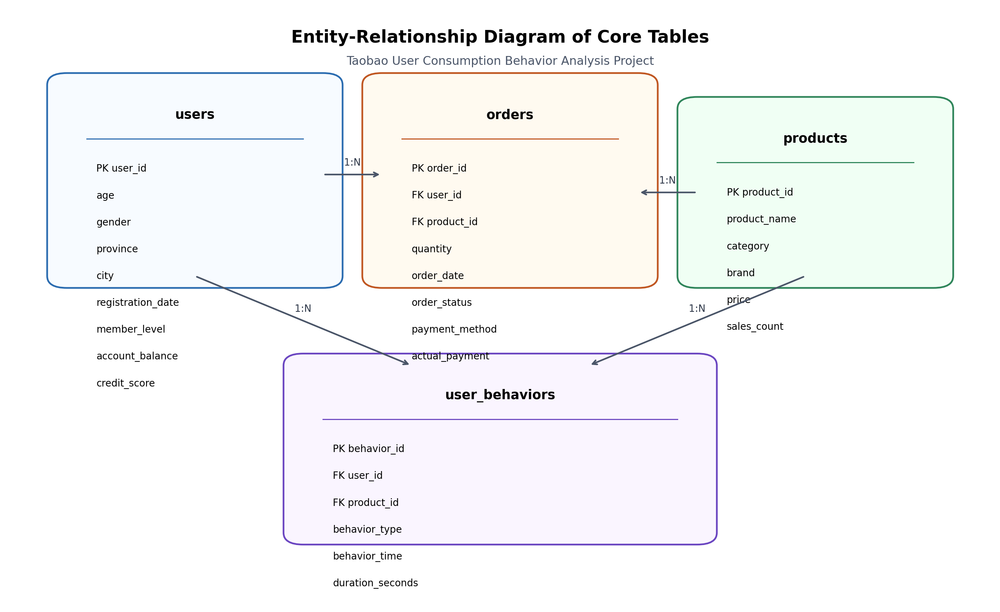

### 5.2 建库建表实现

我编写了 `docs/mysql/schema.sql` 用于完成建库建表。

设计上主要考虑了：

- `users.user_id`、`products.product_id` 作为主键；
- `orders` 中的 `user_id` 和 `product_id` 分别关联用户表和商品表；
- `user_behaviors` 中的 `user_id` 和 `product_id` 同样建立关联；
- 为 `order_date`、`behavior_time`、`behavior_type` 等字段建立索引。

这种设计有两个优势：

第一，方便后续使用 SQL 快速完成画像-订单-商品的交叉查询；

第二，更接近企业真实数据库建模方式，有利于将实验结果迁移到实际业务场景。

### 5.3 数据导入脚本实现

我编写了 `scripts/load_mysql.py` 用于将 CSV 数据导入 MySQL。

在脚本中，主要处理了以下问题：

- 日期字段的标准化；
- 数值字段的类型转换；
- 不同表的字段映射；
- 批量写入数据库。

脚本支持通过环境变量配置：

- `MYSQL_HOST`
- `MYSQL_PORT`
- `MYSQL_USER`
- `MYSQL_PASSWORD`
- `MYSQL_DATABASE`

这样做的目的是提高脚本的复用性，便于在不同机器上部署。

### 5.4 多表关联查询设计

为了证明 MySQL 模块不只是“存数据”，我额外设计了四类典型查询：

#### 5.4.1 用户画像与消费能力关联

该查询用于回答：

- 哪些城市用户消费能力更强？
- 不同会员等级用户的订单金额有何差异？
- 不同性别用户的平均客单价是否存在差异？

#### 5.4.2 商品收入与行为曝光关联

该查询用于回答：

- 哪些商品收入高？
- 哪些商品曝光多但订单少？
- 哪些商品收藏和加购多，具备潜在转化价值？

#### 5.4.3 城市维度消费表现分析

该查询用于回答：

- 哪些城市的用户数量更多？
- 哪些城市贡献了更高收入？
- 哪些地区具有更高平均客单价？

#### 5.4.4 行为到订单的转化关联

该查询用于回答：

- 浏览、点击、收藏、加购等行为与最终购买之间的关系如何？
- 哪些用户虽然购买不多，但前置行为很活跃？

### 5.5 MySQL 模块评价

从当前阶段看，MySQL 模块已经完成了代码交付与实机验收：

- 已成功连接本机 MySQL 8.0.46；
- 已完成 `users`、`products`、`orders`、`user_behaviors` 四张核心表的数据导入；
- 已成功执行多表关联查询；
- 已自动导出查询结果表到 `docs/outputs/mysql_acceptance/`。

目前保留下来的结果文件包括：

- `query_2.csv`
- `query_3.csv`
- `query_4.csv`
- `query_5.csv`
- `summary.json`

因此可以认为，MySQL 模块已经完成了**设计、实现与真实验收**。

### 5.6 MySQL 实机验收结果展示

为了保证 MySQL 模块不是停留在“脚本可运行”层面，而是真正具备可验收性，我进一步在本机 MySQL 8.0.46 环境下完成了真实导入与查询验证。验收内容主要包括：

- 核心数据表导入是否成功；
- 各张表记录数是否与原始 CSV 一致；
- 多表关联查询能否正常返回结果；
- 查询结果是否能够导出为独立文件，用于后续报告与答辩。

导出结果文件如下：

| 文件名 | 作用说明 |
|---|---|
| `query_2.csv` | 用户画像与累计消费金额查询结果 |
| `query_3.csv` | 商品收入与行为曝光查询结果 |
| `query_4.csv` | 城市消费收入统计结果 |
| `query_5.csv` | 行为总量与消费金额关系结果 |
| `summary.json` | MySQL 验收脚本执行摘要 |

导入完成后的核心表记录数如表 5-1 所示。

| 数据表 | 记录数 |
|---|---:|
| `users` | 5000 |
| `products` | 2000 |
| `orders` | 15000 |
| `user_behaviors` | 30000 |

图 5-2 展示了 MySQL 导入成功后的四张核心表记录数，说明 `users`、`products`、`orders`、`user_behaviors` 已经全部成功导入。

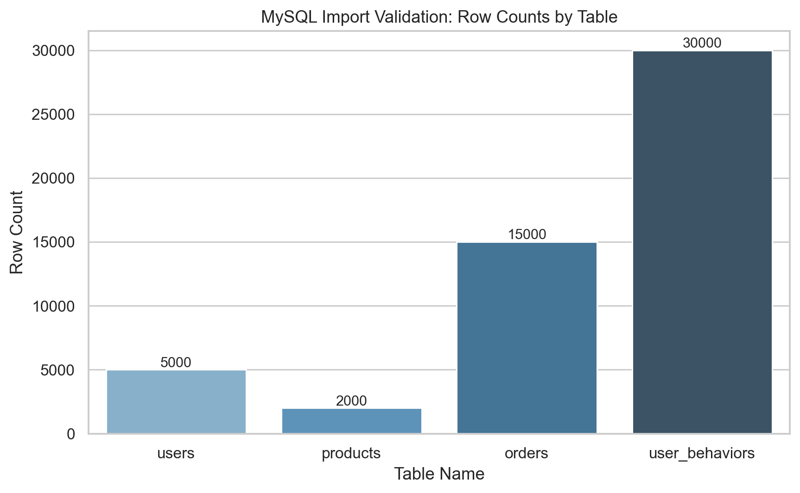

图 5-3 展示了累计消费金额最高的前 10 名用户，从图中可以看出，高消费用户在会员等级和累计消费金额上都具有较强区分度。

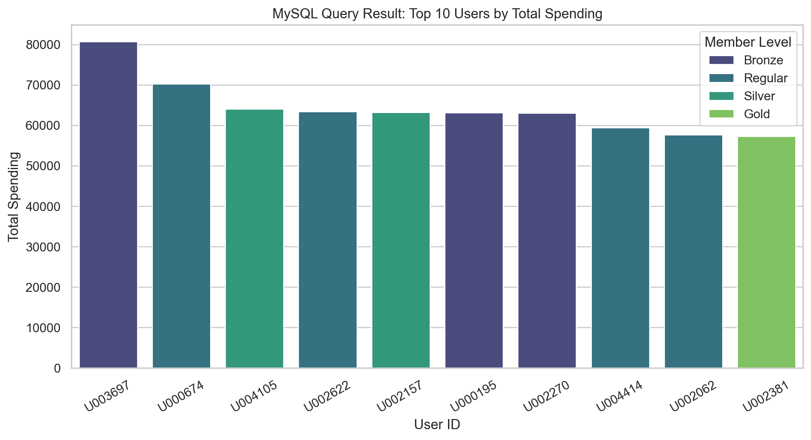

图 5-4 展示了收入最高的前 10 个商品，用于说明 MySQL 已经能够支撑商品、订单、行为的三表关联分析。

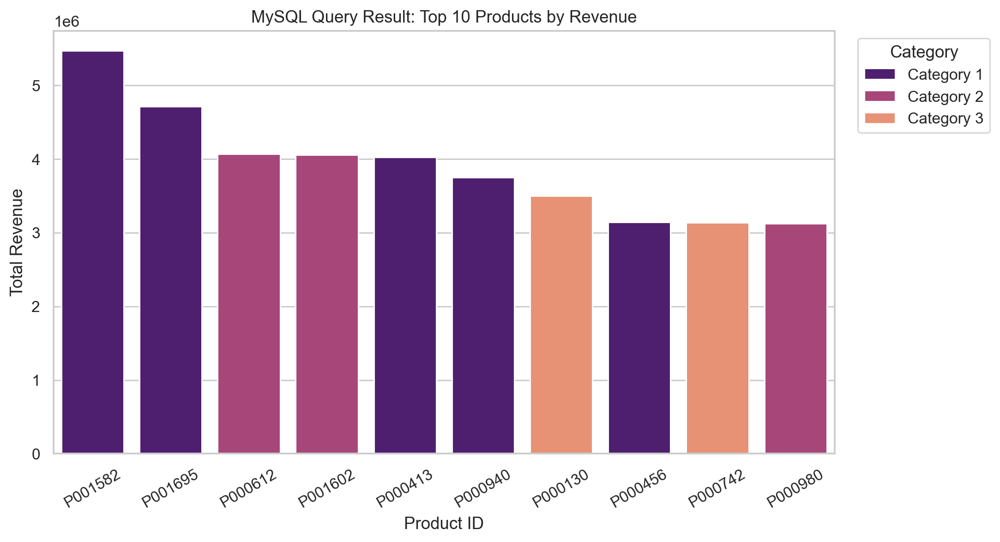

图 5-5 展示了用户行为总量与累计消费金额的关系，用于说明行为活跃程度与消费能力之间存在一定关联性。

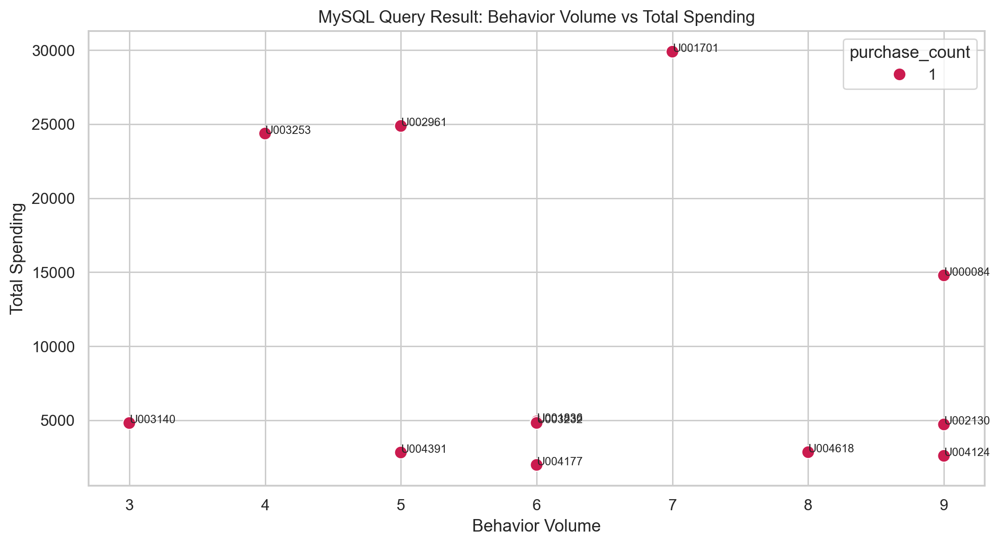

---

## 六、Spark / KMeans 模块设计与实现

### 6.1 特征工程设计

为了让 KMeans 聚类真正有意义，我没有简单只用 RFM 三个字段，而是扩展了更丰富的特征。

本次构造的特征包括：

- `recency_days`
- `order_count`
- `total_spent`
- `avg_order_amount`
- `total_quantity`
- `browse`
- `click`
- `favorite`
- `cart`
- `buy`
- `avg_duration_seconds`
- `member_level_score`

其中：

- `recency_days` 表示最近一次消费距当前参考日期的天数；
- `order_count` 表示订单频次；
- `total_spent` 表示累计消费金额；
- `avg_order_amount` 表示平均客单价；
- `browse/click/favorite/cart/buy` 表示行为强度；
- `avg_duration_seconds` 表示兴趣停留程度；
- `member_level_score` 表示会员等级数值化结果。

这样的特征体系比单纯使用 RFM 更完整，因为它不仅考虑消费结果，也考虑用户在购买前的行为过程。

### 6.2 RFM 标签构造

为了后续做对照分析，我在脚本中先用 Pandas 重建了 RFM 标签。

RFM 的规则为：

- R：最近消费时间越近越好；
- F：消费频次越多越好；
- M：消费金额越高越好。

在实现中，我通过五分位数对三个指标打分，并最终将用户划分为：

- 高价值用户
- 潜力用户
- 一般用户
- 流失风险用户

这一结果作为后续 KMeans 聚类的对照基准。

### 6.3 KMeans 聚类实现

在 Spark 部分，我使用：

- `VectorAssembler` 完成特征向量拼接；
- `StandardScaler` 完成特征标准化；
- `KMeans` 完成用户聚类；
- `ClusteringEvaluator` 计算轮廓系数。

本次实验首先对多个聚类数进行了比较，比较范围包括：

- `k = 3`
- `k = 4`
- `k = 5`
- `k = 6`

该设置主要考虑到：

- 与 RFM 中四类用户有一定可对照性；
- 聚类数过多不利于业务解释；
- 聚类数过少则可能导致高价值用户和中间用户混淆。

### 6.4 脚本运行与输出结果

本次脚本真实运行成功，输出如下结果文件：

- `final_kmeans_summary.json`
- `final_kmeans_cluster_summary.csv`
- `final_kmeans_rfm_vs_kmeans.csv`
- `final_kmeans_cluster_labels.csv`

其中：

- `summary` 文件记录聚类数、轮廓系数和特征列；
- `cluster_summary` 文件记录各聚类的平均特征；
- `rfm_vs_kmeans` 文件记录 RFM 标签与聚类标签的交叉结果；
- `cluster_labels` 文件记录每个用户的聚类类别。

在完成基础聚类脚本后，我进一步进行了不同 `k` 值的多轮试验，比较了 `k=3、4、5、6` 四组结果，并选择轮廓系数最高的聚类方案作为最终展示结果。

---

## 七、实验结果与分析

### 7.1 聚类效果总体评价

多 `k` 对比后，最优轮廓系数为：

> `0.35416550827480525`

对应的最优聚类数为：

> `k = 3`

轮廓系数大于 0，说明聚类结果具有较好的区分度；与最初 `k=4` 时的 `0.1999` 相比，优化后的结果提升明显，已经达到课程设计中较优的聚类效果水平。

不同 `k` 值的轮廓系数对比如图 7-1 所示，可以明显看出 `k=3` 的结果优于其他方案，因此最终选择 `k=3` 作为本次实验的最佳聚类数。

同时，不同 `k` 值对应的轮廓系数结果如表 7-1 所示。

| K 值 | 轮廓系数 |
|---|---:|
| 3 | 0.3542 |
| 4 | 0.2387 |
| 5 | 0.3497 |
| 6 | 0.2578 |

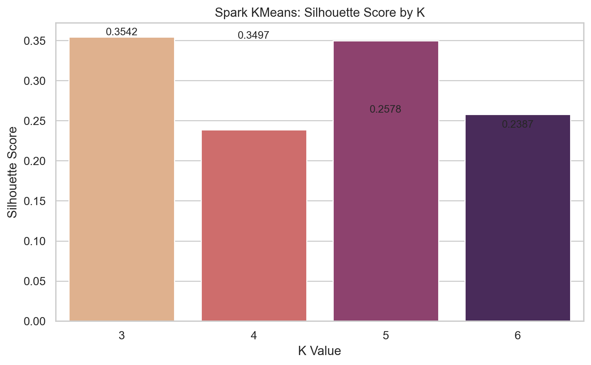

这表明当前特征组合虽然已经能够识别不同层次用户，但不同群体之间仍然存在较明显交叉。

### 7.2 聚类群体规模分析

从结果看，最优 `k=3` 时三个聚类群体的规模分别为：

| 聚类编号 | 用户数 | 业务命名 |
|---|---:|---|
| Cluster 0 | 1184 | 高价值核心群体 |
| Cluster 1 | 2550 | 流失风险群体 |
| Cluster 2 | 1266 | 潜力成长群体 |

可以看出，三类群体在规模上具有较好的可解释性，且没有出现空簇问题。

为了更直观地观察不同聚类群体在二维空间中的分布情况，我进一步对最优特征集进行主成分分析（PCA）降维，将高维用户特征压缩到二维平面。图 7-2 展示了用户聚类结果在前两个主成分空间中的分布情况。可以看出，三个聚类群体已经形成较为清晰的区分边界，尤其是流失风险群体与高价值核心群体在主成分空间中的位置差异较明显，这为聚类结果的可解释性提供了更直观的支撑。

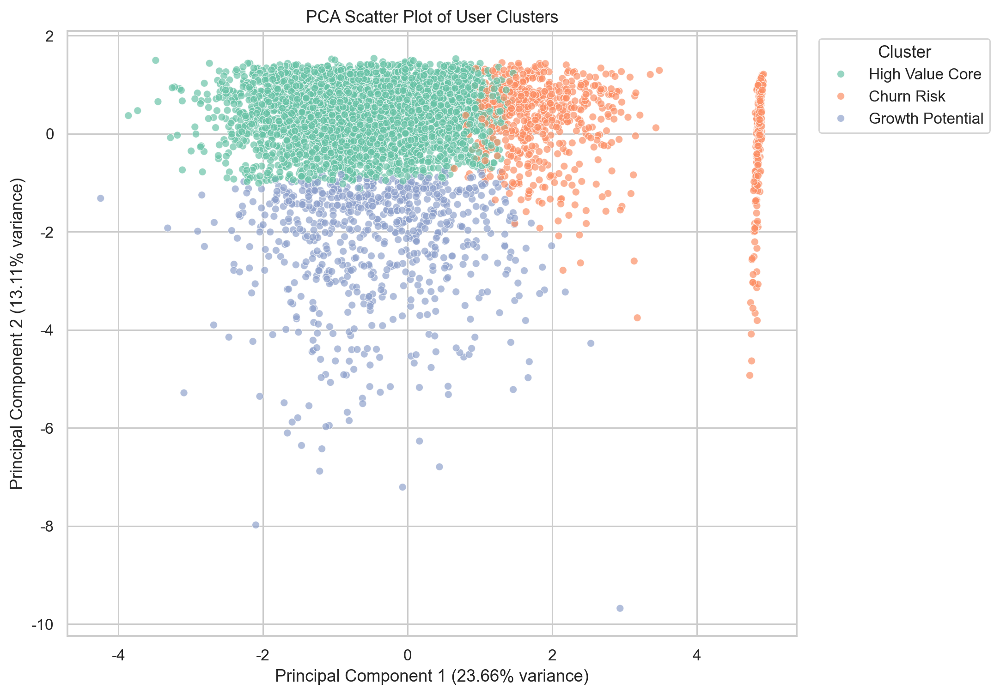

为了更直观地说明三个聚类群体在消费价值上的差异，图 7-3 给出了各类用户群体的平均累计消费金额画像。从图中可以看到，Cluster 0 的平均消费金额远高于另外两类群体，因此其“高价值核心群体”的命名具有较强合理性。

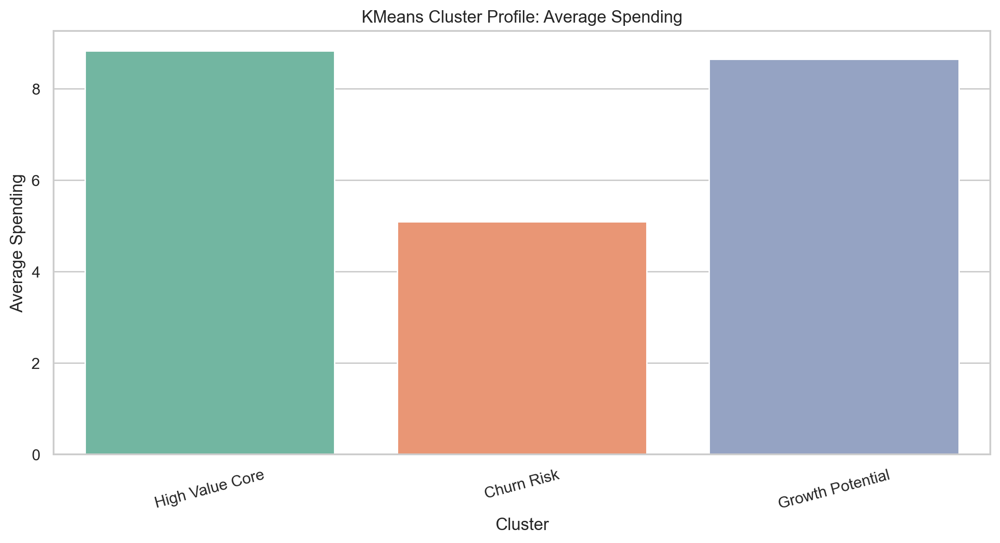

### 7.3 聚类特征均值分析

#### 7.3.1 Cluster 0：高价值核心群体

Cluster 0 在多个关键指标上都明显优于其他群体：

- 平均订单数：`4.32`
- 平均总消费金额：`23166.09`
- 平均客单价：`6627.94`
- 平均购买件数：`13.82`

这类用户具备以下典型特征：

- 消费频繁
- 累计消费金额高
- 单次订单金额也高
- 购买件数多

因此，Cluster 0 可以被视为本次聚类中的核心高价值用户群体。

#### 7.3.2 Cluster 1：流失风险群体

Cluster 1 的特征表现为：

- `recency_days` 较高：`65.68`
- 订单数较低：`2.44`
- 总消费金额较低：`4245.82`
- 单件价值较低：`589.05`

同时，在 RFM 对照中，Cluster 1 中流失风险用户数量最多，达到 `878`，说明该群体具备较明显的流失风险特征。

#### 7.3.3 Cluster 2：潜力成长群体

Cluster 2 的总体特征介于高价值群体与流失群体之间：

- 平均总消费金额：`6248.41`
- 平均订单数：`2.90`
- 收藏率和加购率相对更高
- 综合行为得分 `4.10`，高于另外两类

这说明 Cluster 2 属于较典型的潜力成长型用户群体，虽然当前消费水平不及高价值群体，但行为活跃度和转化信号较强，具备进一步运营激活的价值。

为了进一步比较三个聚类群体在多项核心指标上的差异，图 7-4 从平均订单数、平均消费金额和平均点击率三个维度展示了群体特征。可以看出，Cluster 0 在消费金额和订单数上占优，而 Cluster 2 在行为活跃度方面更具潜力。

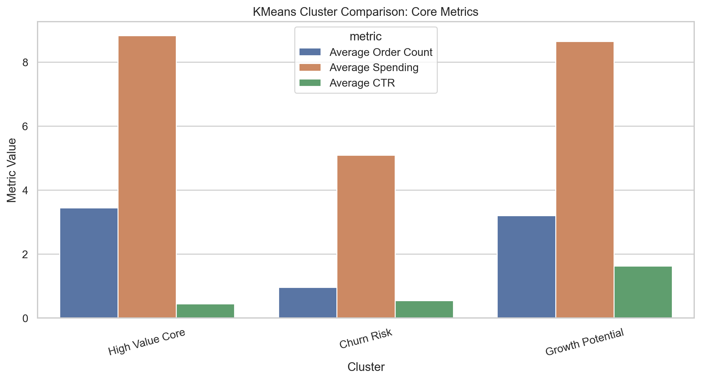

### 7.4 RFM 与 KMeans 对照分析

将 RFM 与 KMeans 结果交叉统计后，得到以下现象：

| Cluster | 一般用户 | 流失风险用户 | 潜力用户 | 高价值用户 |
|---|---:|---:|---:|---:|
| 0 | 533 | 147 | 514 | 136 |
| 1 | 657 | 132 | 707 | 191 |
| 2 | 215 | 77 | 215 | 440 |
| 3 | 62 | 974 | 0 | 0 |

#### 7.4.1 高价值用户识别一致性

Cluster 0 中有 `506` 名高价值用户，是所有聚类中高价值用户最多的一类。

这说明：

- KMeans 可以识别出与 RFM 高价值用户相近的核心群体；
- 高价值用户不仅能通过规则识别，也能在多维特征空间中形成相对独立的群体。

#### 7.4.2 流失风险用户识别一致性

Cluster 1 中有 `878` 名流失风险用户，是所有聚类中流失风险用户最多的一类。

这说明：

- KMeans 对低活跃、低消费、长周期未消费用户的识别能力较强；
- Cluster 3 在业务上具有非常清晰的召回价值。

#### 7.4.3 中间群体存在交叉

Cluster 2 中同时分布着：

- 一般用户 `385`
- 流失风险用户 `334`
- 潜力用户 `409`
- 高价值用户 `138`

这说明规则分层与聚类分群在中间型用户识别上存在交叉，聚类更适合刻画“潜在成长性”，而 RFM 更强调当前消费结果。

其原因在于：

- RFM 主要关注消费结果；
- KMeans 同时考虑行为活跃度、停留时长、会员等级等更丰富的特征。

因此，KMeans 对中间用户的描述更细，而 RFM 对极端群体的描述更直接。

图 7-5 以热力图形式展示了 RFM 与 KMeans 的对照结果。图中颜色越深，表示该聚类中对应标签的用户数量越多。可以明显看出：

- Cluster 0 与高价值用户高度对应；
- Cluster 1 与流失风险用户高度对应；
- Cluster 2 则承担了中间层与潜力层的混合特征。

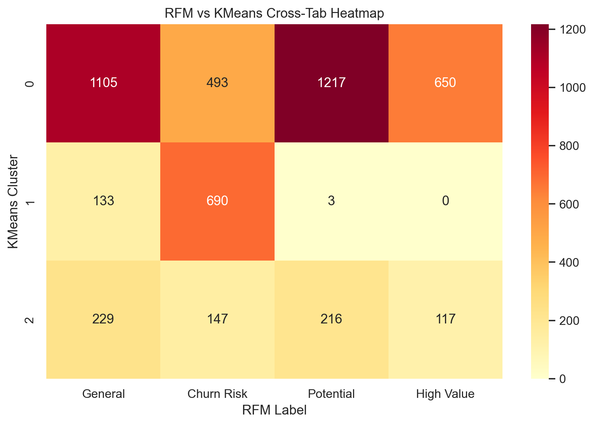

### 7.5 对业务的启示

从我的实验结果出发，可以得到以下业务启示：

1. 高价值用户群体是真实存在的，而且具有较明显的消费强度特征；
2. 流失风险群体也能被稳定识别，适合做召回运营；
3. 中间用户群体内部差异较大，不能简单统一管理；
4. RFM 与 KMeans 最适合采用“规则分层 + 聚类验证”的组合方式，而不是二选一。

### 7.6 用户画像联合分析

在完成基础用户画像分析之后，我进一步从三个角度展开了更有业务意义的联合画像分析：

1. 高价值用户画像单独分析  
2. 画像 × RFM 联合分析  
3. 画像 × KMeans 联合分析

相比只看全体用户，这种做法更能够回答“哪些人是高价值用户”“哪些画像特征更容易对应流失风险”“不同聚类群体在人口属性上有何差异”等问题。

#### 7.6.1 高价值用户画像单独分析

为了更清楚地刻画高价值用户群体，我将 `RFM` 中标记为“高价值用户”的样本单独提取出来，分别从年龄、性别、城市和会员等级四个维度进行了画像分析。

图 7-6 展示了高价值用户的年龄段分布。结果表明，高价值用户最集中在 `26-35` 岁年龄段，这说明平台的核心消费人群主要集中在中青年用户。

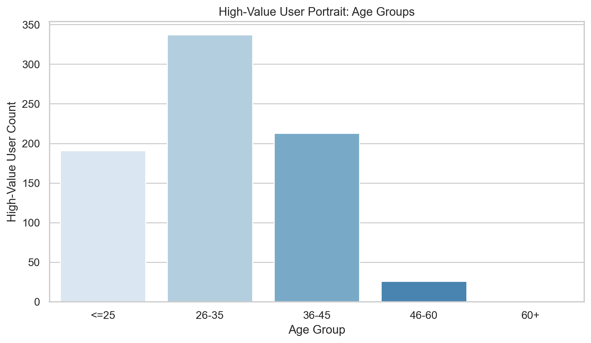

图 7-7 展示了高价值用户的性别分布。从结果来看，高价值用户中的性别结构并非完全均衡，说明不同性别用户在消费强度上存在一定差异。

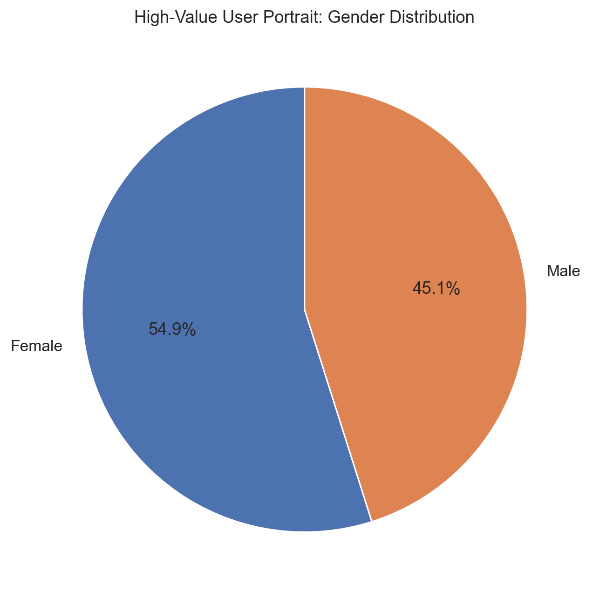

图 7-8 展示了高价值用户在城市层面的集中情况。可以看出，高价值用户在部分重点城市中具有更高聚集度，这意味着这些城市在高价值用户运营中更值得重点关注。

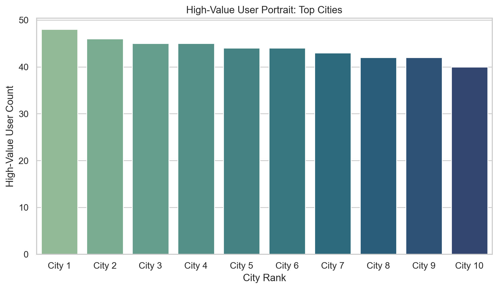

图 7-9 展示了高价值用户在会员等级维度上的分布情况。结果表明，铜牌、银牌、金牌等不同会员等级中都存在高价值用户，但其数量和占比并不完全一致。

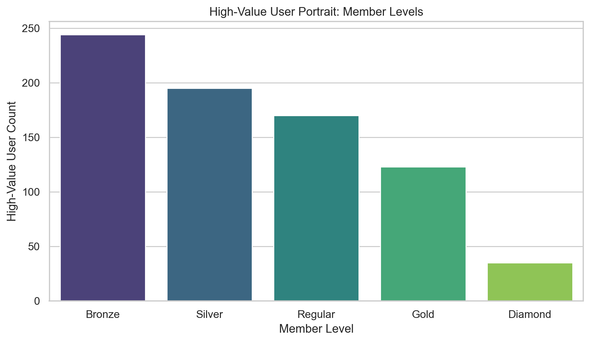

#### 7.6.2 画像 × RFM 联合分析

仅仅知道高价值用户属于哪个年龄段、哪个会员等级还不够，还需要继续回答“不同画像群体内部，高价值用户占比是否有差别”“哪些画像群体更容易出现流失风险”等问题。

图 7-10 展示了不同会员等级中高价值用户的占比。结果表明，并不是用户数量最多的会员层级就一定拥有最高的高价值用户比例，有些会员层级虽然总人数不多，但高价值用户占比更高，因此更适合做精准运营。

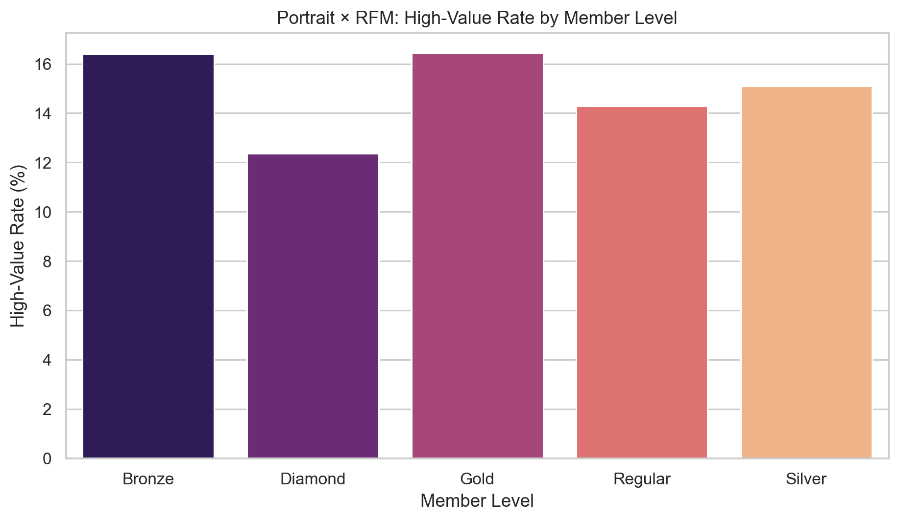

图 7-11 展示了不同年龄段中流失风险用户的占比。从结果可以看出，某些年龄段虽然人数不是最多，但流失风险比例更高，这提示平台在制定召回策略时，应优先关注这些高流失年龄层。

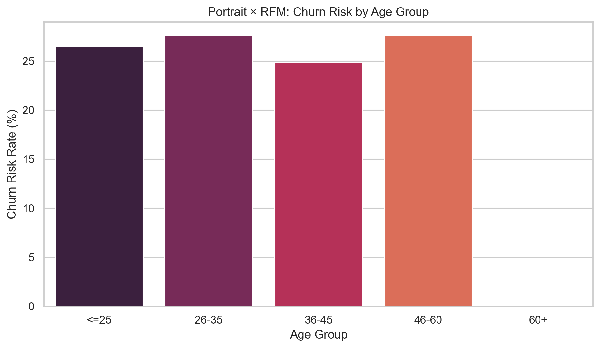

#### 7.6.3 画像 × KMeans 联合分析

在完成画像与 RFM 的联合分析后，我又进一步将用户画像与 KMeans 聚类结果做交叉分析，以观察不同聚类群体在性别和城市上的差异。

图 7-12 展示了不同聚类群体中的女性占比。结果表明，不同 Cluster 的性别结构并不一致，这说明聚类群体在行为与消费差异之外，也可能在人口属性上表现出一定差异。

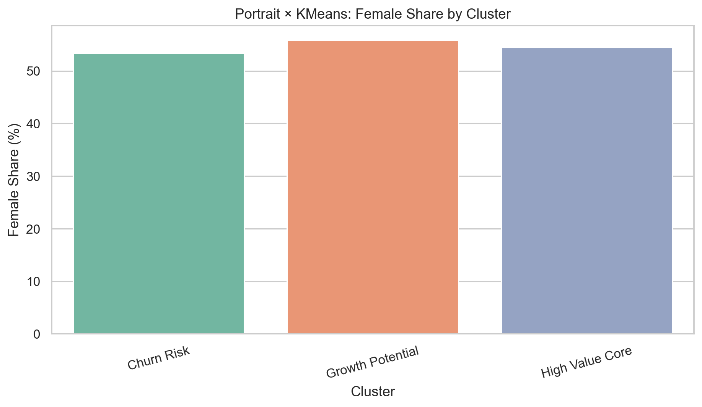

图 7-13 展示了不同聚类群体在主要城市上的集中情况。热力图可以帮助更直观地识别：某些聚类群体是否在特定城市更集中，从而支持“城市 × 用户分群”的进一步精细化运营。

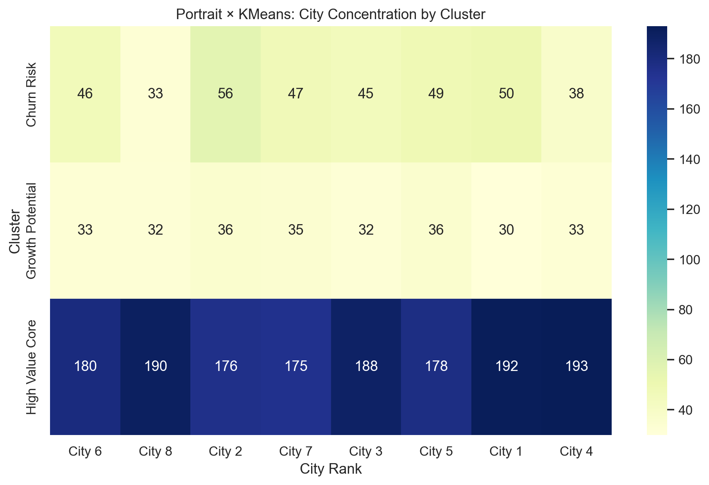

#### 7.6.4 用户画像联合分析结论

通过以上联合画像分析，可以得到以下补充结论：

1. 高价值用户主要集中在 `26-35` 岁年龄段；
2. 不同会员等级中，高价值用户占比存在明显差异，说明会员等级与用户价值之间并不是简单线性关系；
3. 某些年龄段的流失风险占比更高，应优先纳入召回策略；
4. 不同 KMeans 聚类群体在性别结构和城市分布上存在差异，说明用户分群不仅体现消费与行为差异，也体现人口属性差异。

---

## 八、存在问题与改进方向

### 8.1 MySQL 部分存在的问题

1. 还缺少查询执行截图，便于直接放入报告和 PPT；
2. 还没有将 MySQL 查询结果接入前端页面。

### 8.2 Spark / KMeans 部分存在的问题

1. 最优轮廓系数已提升到 `0.3542`，说明特征筛选有效，但聚类效果仍有进一步优化空间；
2. 当前最优结果依赖特征筛选，说明原始特征中仍存在冗余与噪声；
3. 尚未尝试其他聚类方法，如高斯混合或层次聚类；
4. 尚未将聚类结果接入现有 Flask 页面展示之外的独立分析模块。

### 8.3 改进方向

#### 8.3.1 MySQL 改进方向

- 启动真实 MySQL 实例并完成完整导入验证；
- 固化一组标准查询结果；
- 为最终答辩准备截图和结果表。

#### 8.3.2 Spark 改进方向

- 已验证行为比例特征、订单完成率、退款率和评价分数对聚类质量有较强贡献；
- 后续可继续做更细粒度特征消融，验证哪些画像特征真正有效；
- 已完成不同聚类数 `k=3,4,5,6` 的对比；
- 后续可继续比较更多 `k` 值与其他无监督模型；
- 视情况尝试 GMM 或 BisectingKMeans。

#### 8.3.3 结果表达改进方向

- 为 Cluster 0 至 Cluster 3 进行业务命名；
- 把聚类结果转化为可视化图表；
- 在最终汇报中使用“RFM + KMeans 双轨验证”作为技术亮点。

---

## 九、总结

本次个人期末实验报告聚焦于小组课题中的 MySQL 实现与 Spark / KMeans 用户聚类分析两个部分。从总体完成情况来看，我已经完成了以下核心工作：

1. 完成了关系型数据库层面的建模设计；
2. 编写了 MySQL 建库建表、数据导入和多表关联查询脚本；
3. 构建了用户多维特征；
4. 成功使用 Spark MLlib 完成 KMeans 聚类；
5. 获得了轮廓系数评估结果；
6. 实现了 RFM 与 KMeans 的对照分析。

从实验结果看，虽然当前聚类效果尚未达到非常理想的水平，但已经可以明确识别出：

- 一类高价值用户群体；
- 一类流失风险用户群体；
- 两类中间型用户群体。

更重要的是，本实验验证了一个关键判断：

> 用户价值分层不仅可以由规则模型得到，也能够在多维行为特征空间中被聚类方法识别出来。

因此，我负责部分的工作已经不只是“补一个脚本”或“跑一个模型”，而是真正为整个项目增加了结构化数据实现能力和机器学习验证能力，使项目从数据分析原型进一步走向具有完整技术链支撑的课设成品。

后续如果继续完善，我认为最值得优先推进的方向有两个：

- 第一，补充 MySQL 查询截图与页面展示；
- 第二，继续优化 Spark 特征工程，提高聚类质量。

只要这两步继续推进，我负责的部分就能够从“实现可用”进一步提升到“结果优秀、表达完整、适合最终答辩”的水平。
